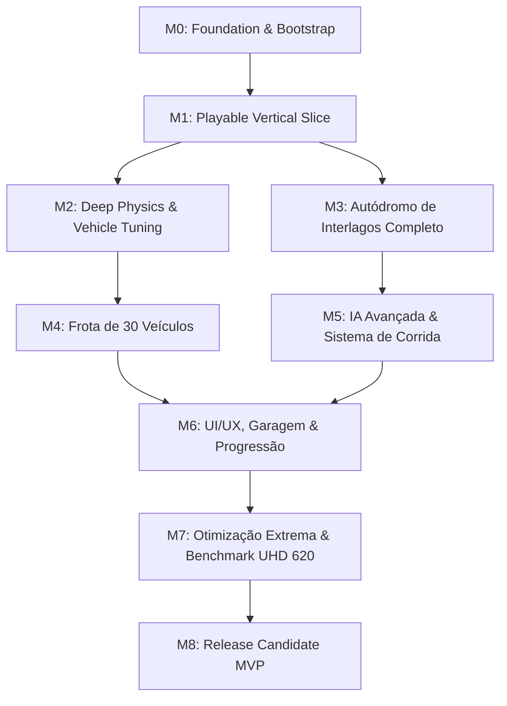

# Plano de Implementação Completo — Interlagos Racing (AI-Driven)

**Projeto:** Interlagos Racing  
**Referência:** Gran Turismo 4 (Física Simcade 65/35, Sensação de Peso, Transferência de Carga, Pneus)  
**Engine Base:** Godot 4.x (Compatibility Renderer / GL Compatibility)  
**Hardware Alvo Principal:** Intel UHD Graphics 620 + 12GB RAM (Meta: 720p 30-45+ FPS Estáveis)  
**Versão do Plano:** 1.0  
**Data:** 2026-08-24  

---

## 1. Visão Geral & Filosofia de Desenvolvimento

O projeto é desenvolvido através de uma arquitetura **AI-First / Multi-Agent**, orquestrada pelo agente central **GAME-MASTER ORCHESTRATOR**, com verificação independente via **QA Agent** (Score 0–10 com critério de aprovação $\ge 8.5$).

### Princípios Chave:
1. **Vertical Slice Primeiro:** Antes de escalar para os 30 carros e pista com todos os detalhes de cenário, focar em entregar **1 carro completo + trecho de Interlagos + física simcade + HUD + IA + Corrida jogável de ponta a ponta**.
2. **Qualidade Percebida por Custo Computacional:** Budget rigoroso de GPU/CPU para rodar com folga em gráficos integrados Intel UHD 620.
3. **Desacoplamento e Modularidade:** Parâmetros físicos externalizados em arquivos de dados (`.json`/`.tres`/`.yaml`), permitindo tuning sem quebrar o core do motor de física.
4. **Proteção de Propriedade Intelectual:** Assets e modelos próprios/licenciados, nomes fictícios ou autorizados, sem extração de dados proprietários da franquia Gran Turismo.

---

## 2. Roteiro de Milestones (M0 a M8)

---

## 3. Detalhamento dos Milestones e Tarefas

### Milestone 0: Foundation & Bootstrap (M0) — **[PONTO DE PARTIDA]**
*Objetivo: Estabelecer a base do projeto Godot 4.x, padrões, repositório, pipeline de QA e ferramentas de automação.*

- [x] **ARCH-001:** Definir arquitetura de pastas e padrões modulares.
- [ ] **ARCH-002:** Configurar repositório Git, `.gitignore` (Godot 4.x), branch model (`feature/<task-id>`).
- [ ] **ARCH-003:** Inicializar projeto Godot 4.x com renderer Compatibility, resolução base 1280x720 (com escalonamento FSR/Bilinear), framerate target e input map inicial.
- [ ] **ARCH-004:** Criar rotina de build e export automatizada para Windows PC.
- [ ] **ARCH-005:** Estruturar gerenciamento de estado e tarefas em `/project-state/`.
- [ ] **ARCH-006:** Implementar suite e harness do **QA Agent** com checklist de validação e cálculo de score (Funcionalidade, Qualidade Técnica, Performance, Integração, UX).
- [ ] **ARCH-007:** Criar ferramenta de Benchmark headless/autônomo e coletor de métricas (FPS, Frame Time, Draw Calls, Memória).

---

### Milestone 1: Playable Vertical Slice (M1) — **[PROVA DE CONCEITO INTEGRADA]**
*Objetivo: Entregar o ciclo completo de gameplay com 1 veículo protótipo, 1 setor de Interlagos, física básica GT4-style, câmera dinâmica, HUD e IA básica.*

- **CAR-001 (Protótipo):** Implementar veículo protótipo (Hatch esportivo ou Sedan esportivo - física RWD/FWD) com modelo 3D low-poly otimizado, 4 rodas independentes e colisor tridimensional.
- **PHY-001 (Física Base):** Raycast suspension ou Wheel collider com transferência de massa longitudinal e lateral, slip angle simplificado (Pacejka ou aproximação empírica) e curva de torque de motor com transmissão manual/automática.
- **TRK-001 (Interlagos Slice):** Modelagem do trecho do *S do Senna*, *Curva do Sol* e *Reta Oposta* com elevação real (desnível fiel), zebras com bump físico e limites de pista.
- **CAM-001 (Sistema de Câmeras):** Câmera de perseguição (Chase Cam) com interpolação suave (lag/damping), FOV dinâmico conforme velocidade, câmera de capô (Hood) e Cockpit/Bumper.
- **INP-001 (Input Multi-dispositivo):** Gerenciador de input para Teclado (WASD/Setas) e Gamepad (XInput com aceleração/frenagem analógica nos gatilhos LT/RT e direção no analógico esquerdo).
- **RCE-001 (Race Loop Vertical):** Grid de largada simplificado (1 Player + 3 IAs), sistema de checkpoints, contagem de voltas, cronometragem de tempo de volta e tela de resultados.
- **HUD-001 (HUD de Corrida):** Velocímetro digital/analógico, tacômetro (RPM com redline alert), indicador de marcha, posição na corrida (P1..P4), volta atual e tempos (lap time / best lap).
- **AUD-001 (Áudio Base):** Camadas de motor moduladas por RPM/pitch, som de atrito de pneus (squeal de derrapagem progressivo) e efeitos de vento.
- **QA-M1-GATE:** Executar bateria completa do QA Agent no Vertical Slice. **Gate: Score $\ge 8.5$**.

---

### Milestone 2: Física Aprofundada & Assistências (M2)
*Objetivo: Refinar a dirigibilidade ao padrão "Simcade 65/35" (sensação GT4).*

- **PHY-002 (Modelo de Pneus Avançado):** Relação atrito/escorregamento lateral e longitudinal, perda gradual de aderência, transição de aderência em zebras e grama/asfalto.
- **PHY-003 (Suspensão & Transferência de Carga):** Molas, amortecedores, bump stops, barras estabilizadoras dianteira/traseira (anti-roll bars) e mergulho em frenagens fortes (brake dive).
- **PHY-004 (Transmissão & Diferenciais):** Diferencial aberto, LSD (Limited Slip Differential) e tração integral AWD com distribuição de torque configurável.
- **PHY-005 (Sistema de Freios & ABS):** Bias de freio (distribuição frente/traseira), simulação de travamento de rodas e sistema ABS modular.
- **AST-001 (Assistências de Direção):** Controle de Tração (TCS), Controle Eletrônico de Estabilidade (ESC/ESP), Direção assistida para teclado/gamepad.
- **AST-002 (Presets de Pilotagem):** Presets Novato, Normal, Pro e Custom.
- **TEL-001 (Ferramenta de Telemetria Interna):** Painel de debug em tempo real (G-forces, slip angle por roda, compressão de suspensão, torque entregue).

---

### Milestone 3: Autódromo José Carlos Pace (Interlagos Completo) (M3)
*Objetivo: Construção completa dos 4.309 metros de Interlagos com otimização gráfica estrita.*

- **TRK-002 (Traçado Completo & Geometria):** Modelagem completa das 11 curvas (S do Senna, Curva do Sol, Curva do Lago, Ferradura/Laranjinha, Pinheirinho, Bico de Pato, Mergulho, Junção, Subida dos Boxes e Reta Principal).
- **TRK-003 (Topografia & Elevação):** Variação altimétrica exata (~56 metros de desnível) e cambagem de pista nas curvas (camber positivo/negativo).
- **TRK-004 (Áreas de Escape, Zebras e Barreiras):** Zebras tridimensionais otimizadas, guard-rails, barreiras de pneus, caixas de brita com desaceleração física.
- **TRK-005 (Pit Lane & Boxes):** Entrada e saída de pit lane, boxes funcionais e grid de largada para até 16 carros.
- **TRK-006 (Cenário & LOD de Pista):** Arquibancadas, torre de cronometragem, pontes, árvores (instanced billboards/LOD meshes), skyline urbano distante e iluminação baked/otimizada.

---

### Milestone 4: Frota Completa de 30 Veículos (M4)
*Objetivo: Integrar as 30 variantes e categorias de veículos com parametrização em arquivos de dados.*

- **VEH-DATA-001 (Schema de Dados):** Estrutura YAML/JSON/Resource para parâmetros físicos (massa, torque curve, gearbox ratios, aero drag, aero downforce, grip multipliers, drivetrain).
- **VEH-CAT-001 a 006 (Categorias de Veículos):**
  1. *Hot Hatches / Compactos Esportivos* (FWD / AWD) — 6 modelos
  2. *Sedans Esportivos & Gran Coupe* (RWD / AWD) — 6 modelos
  3. *Cupês Esportivos & Muscle Cars* (RWD) — 6 modelos
  4. *Superesportivos & Track Toys* (Mid-Engine RWD / AWD) — 6 modelos
  5. *SUVs de Alta Performance* (AWD) — 3 modelos
  6. *Carros de Turismo / Race Spec* — 3 modelos
- **VEH-GFX-001 (LODs & Otimização de Mesh):** LOD0 (alta proximidade), LOD1 (média distância), LOD2/LOD3 (grid distante), interiores simplificados e materiais PBR otimizados.
- **VEH-AUD-001 (Banco de Áudio por Motorização):** Perfis sonoros (4 cilindros Turbo, 6 cilindros em linha/V6, V8 aspirado/supercharged, V10/V12 e Elétrico/Híbrido).

---

### Milestone 5: IA de Corrida & Dinâmica de Eventos (M5)
*Objetivo: IA competitiva, justa e inteligente com comportamento de pelotão e ultrapassagens.*

- **AI-001 (Waypoint & Racing Line):** Grafo de waypoints tridimensional de Interlagos com linha ideal de corrida (traçado de tangência e frenagem).
- **AI-002 (Controlador de Direção da IA):** Cálculo de velocidade alvo, zonas de desaceleração e ponto de frenagem baseados no veículo conduzido.
- **AI-003 (Consciência Espacial & Ultrapassagem):** Detecção de carros próximos (raycasts / spatial queries), defesa de linha, manobras de ultrapassagem limpas e evitar colisões desnecessárias.
- **AI-004 (Níveis de Dificuldade):** Dificuldade calibrada (Easy, Normal, Hard, Expert) ajustando agressividade e precisão sem hacks irreais de velocidade.
- **AI-005 (Recuperação de Erro):** Manobra de retorno à pista após rodar ou sair na brita/grama.

---

### Milestone 6: Interface de Usuário, Garagem & Progressão (M6)
*Objetivo: Interface moderna, responsiva, fluida e com suporte a navegação por teclado/gamepad.*

- **UI-001 (Design System & Menu Principal):** Menus elegantes com tema escuro, tipografia moderna, efeitos sutis de transição e navegação fluida.
- **UI-002 (Seleção de Veículo & Garagem 3D):** Visualizador de carros em tempo real, exibição de especificações técnicas (Potência, Torque, Peso, Tração, Classe).
- **UI-003 (Seleção de Evento & Modo de Jogo):** Time Trial (Tomada de Tempo), Corrida Rápida (Quick Race) com configuração de grid (1 a 15 oponentes) e voltas (1 a 20).
- **UI-004 (Menu de Opções & Configurações Gráficas):** Ajuste de resolução, limitador de FPS, presets gráficos (Ultra Low, Low, Medium, High, Custom), remapeamento de controles e volume de áudio.
- **UI-005 (Minimapa Dinâmico):** Radar/minimapa em tempo real mostrando traçado da pista e pontos coloridos para cada veículo.

---

### Milestone 7: Otimização Extrema & Validação Intel UHD 620 (M7)
*Objetivo: Garantir estabilidade e taxa de quadros conforme meta de hardware.*

- **OPT-001 (Draw Call & Batching Tuning):** Mesclagem de superfícies estáticas de pista, uso de MultiMeshInstance3D para árvores e zebras, remoção de overdraw.
- **OPT-002 (Configuração de Shaders & Materiais):** Materiais compatíveis com OpenGL / GL Compatibility, eliminação de shaders pesados em tempo real.
- **OPT-003 (Occlusion Culling & Frustum Culling):** Árvore de oclusão para cenários de Interlagos, ocultando estruturas fora do campo de visão do jogador.
- **OPT-004 (Gerenciador de Memória & Asset Streaming):** Compressão de texturas (VRAM compressed formats - ETC2/ASTC/S3TC), carregamento assíncrono para tempos de load reduzidos.
- **OPT-005 (Bateria Oficial de Benchmarks):** Execução do cenário de stress (16 carros na largada na reta principal sob preset Low 720p). **Meta: $\ge 30$ FPS (mínimo), $\ge 43$ FPS (média).**

---

### Milestone 8: Release Candidate & Fechamento de MVP (M8)
*Objetivo: Testes finais de regressão, polimento de UX e empacotamento executável.*

- **REL-001 (Smoke & Regression Testing):** Verificação de todos os requisitos P0 (P0-001 a P0-020 do PRD).
- **REL-002 (Persistência & Save System):** Salvamento de melhores voltas, configurações de usuário e progresso em arquivo local seguro.
- **REL-003 (Build Final PC Windows):** Geração do executável `.exe` com todos os pacotes `.pck` consolidados e testados em ambiente limpo.
- **REL-004 (Documentação Legal & Licenças):** Registro no `LEGAL_AND_LICENSE.md` de todos os assets, bibliotecas e licenças utilizadas.
- **QA-FINAL-GATE:** Score final do QA Agent $\ge 8.5/10$.

---

## 4. Onde Começamos Agora? (Primeiros Passos Práticos)

Para iniciar de imediato com a máxima eficiência e conformidade ao PRD:

1. **Sprint Bootstrap (M0):**
   - **Passo 1:** Configurar a estrutura de controle no Git e documentação.
   - **Passo 2:** Inicializar o arquivo base `project.godot` com Renderer Compatibility e configurações 720p/UHD 620.
   - **Passo 3:** Implementar o script do **QA Harness** para pontuação automatizada de cada entrega.
   - **Passo 4:** Partir imediatamente para o **Vertical Slice (M1)**: Veículo protótipo + Trecho inicial do traçado de Interlagos + Câmera e Controles.

---
*Documento gerado e salvo em conformidade com as diretrizes do PRD Interlagos Racing.*
